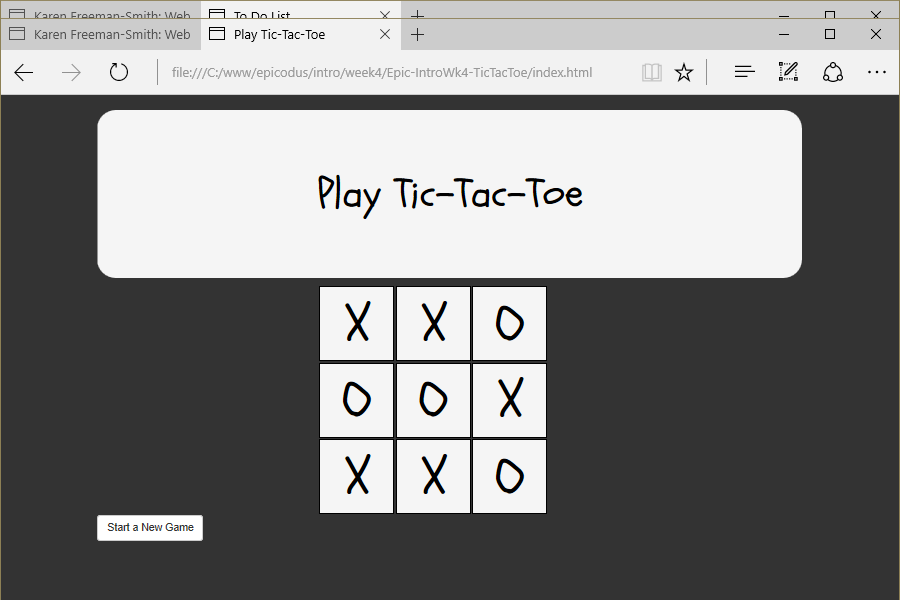

# Tic-Tac-Toe
Version 0.0.2: August 25, 2016
by [Karen Freeman-Smith](https://karenfreemansmith.github.io) and [Kyle Lange](https://github.com/kylelange)

### Technologies Used
HTML, CSS, Bootstrap, JavaScript, jQuery

## Description
*[Epicodus](http://epicodus.com) Intro to Programming Week 4 Pair Project with Kyle Lange: A web-based game of tic-tac-toe.*

## Setup/Installation
* [View on Github Pages](https://karenfreemansmith.github.io/Epic-IntroWk4-TicTacToe)
* _OR_
* Clone directory
* Open index.html in your favorite browser

## Support & Contact
For questions, concerns, or suggestions please email karenfreemansmith@gmail.com

## Specifications
* A player should know whether it's an X or an O and be able to report that (e.g. player.mark() could return "X" or "O").
* A space should know its coordinates and be able to be marked by a player (e.g., space.mark(player_X)).
* A space should be able to report who it's marked by (e.g. space.markedby() could return "X" or "O", or it could return a player object - player1 or player2).
* A board should create 9 spaces with the proper coordinates, and tell if there are three in a row marked by the same player. A board should be able to return a space by its coordinates (e.g., board.find(1, 2)).
* A game should create 2 players and a board, be able to move to the next turn, know which player's turn it is, and be able to tell if the game is over or not.

## Known Issues
* None

## Legal
*Licensed under the GNU General Public License v3.0*

Copyright (c) 2016 Copyright _[Karen Freeman-Smith](https://karenfreemansmith.github.io) & [Kyle Lange](https://github.com/kylelange)_ All Rights Reserved.
